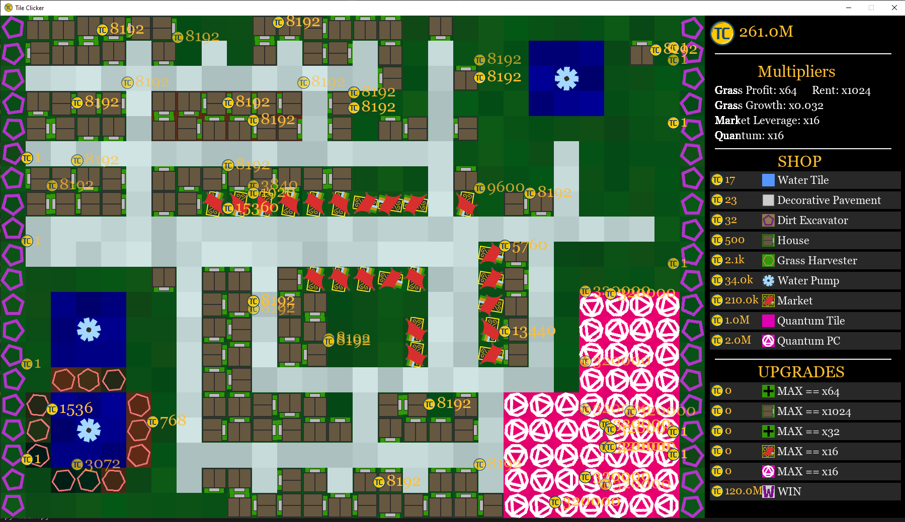

# Tile Clicker



## Table of Contents
- Description
- Requirements
- How to Install
- How to Run
- Tests
- Controls
- List of Tiles in game
- List of Machines in game
- List of Upgrades in game

## Description
A cookie clicker-type game built in pygame composed of large 2d minecraft-esque tiles. A player clicks these tiles to gain money, which can then be used to purchase machines that passively make the player money, or to purchase tiles that can improve the tile environment. The goal is to buy a WIN Ticket, costing 1 Billion tilecoins.

## Requirements
1. The game can take up quite a bit of screen real-estate and unfortunately does not have any resizing options, a 1920x1080 monitor is fine so long as the operating system UI is only scaled 100%. A 2560x1440 monitor is fine so long as UI has a max scale of 125%.
2. Performance can be an issue with mid and low-end hardware, but some optimizations have been included, including a dynamic renderer that will cut expensive renders in fractions if it starts to lag. Please run locally (not on Codio)
3. Python 3.8 or higher
4. pip (Python package installer)

## Install
1. Unzip the game folder if it came in a .zip file.
```sh
pip install pygame
```

## RUN:
```sh
python main.py
```

## Tests
```sh
pytest
```

## Controls
- Left clicking a tile will net you some amount of tilecoin.  
- Left clicking on a tile or machine in the shop will select it(red background).  
- If something is selected and you click a tile, it will buy that tile and place it there.  
- Right clicking will deselect any selection, as well as left clicking on a selected button.  
- Some tiles and machines can be sold by selecting that tile or machine, then clicking the tile you wish to sell. (ex. to sell a grass harvester, first select the grass harvester, then click in the world the grass harvester to sell).  
- ESC will display most relevant information.  
- Left clicking an upgrade will automatically apply that upgrade to the world.  

## List of tiles:
- Dirt(default), produces +1 coin/click.  
- Water, which spawns grass in adjacent tiles. It eventually evaporates. Does not produce anything.  
- Grass, produces +2-8 coins/click(depending on grass growth). A grass tile will start growing next to water. Grass will exhaust after 1 click, becoming dirt.  
- Decorative Pavement produces +7 coins/click.  
- Quantum tile produces +21k coins/click.  

## List of placeable machines(amount of profit will depend on upgrades purchased):
- Dirt Excavator, place on dirt.  
- Grass Harvester, place on grass. Will not deplete grass.  
- House, will randomly generate rent.  
- Water Pump, constantly refreshes evaporating water surrounding it.  
- Market, will profit overall, but may lose money.  
- Quantum PC, place on quantum tile for large profits.  

## Upgrades will double profit of a machine but will cause the next upgrade to cost triple(still worth it!):
- Grass profits  
- House rents  
- Grass spreads from grass multiplier  
- Market leverage (will overall average positive profits, but can start to lose a lot)  
- Quantum PC profits  


